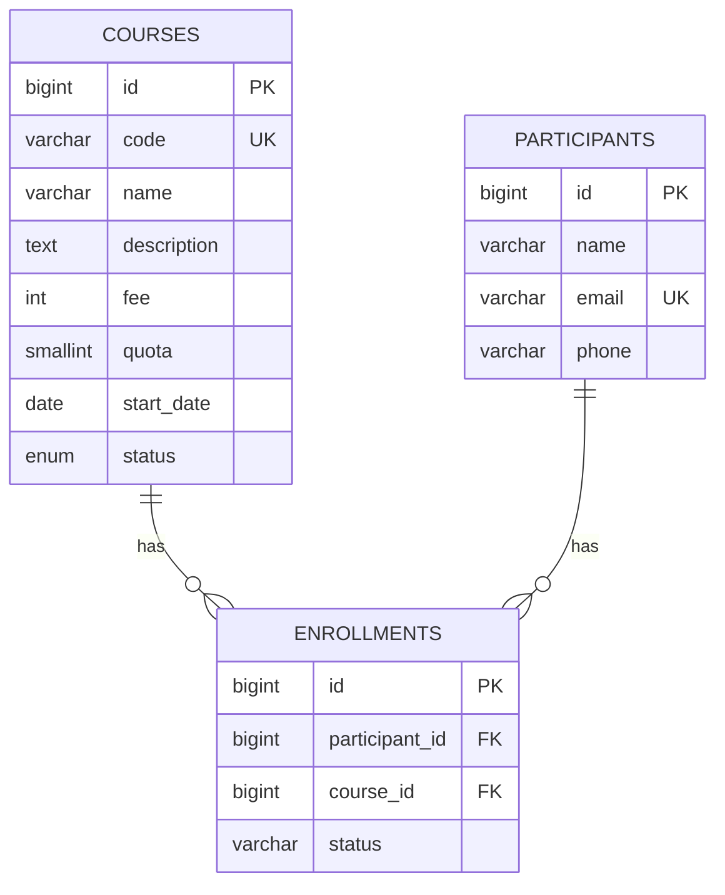

# ERD KursusKu

```mermaid
erDiagram
    COURSES ||--o{ ENROLLMENTS : has
    PARTICIPANTS ||--o{ ENROLLMENTS : has

    COURSES {
        bigint id PK
        varchar code UK
        varchar name
        text description
        int fee
        smallint quota
        date start_date
        enum status
    }

    PARTICIPANTS {
        bigint id PK
        varchar name
        varchar email UK
        varchar phone
    }

    ENROLLMENTS {
        bigint id PK
        bigint participant_id FK
        bigint course_id FK
        varchar status
    }
```

Composite unique pada Enrollment: `(participant_id, course_id)`.
